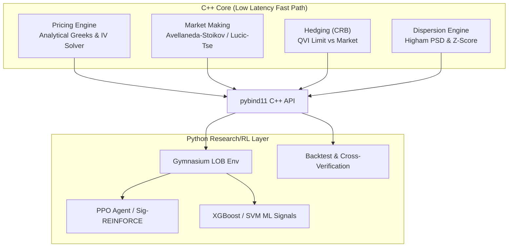

# High-Frequency Volatility Market Maker & Dispersion Arbitrage Engine


An institutional-grade, low-latency options market-making and volatility dispersion arbitrage engine. This system integrates continuous-time stochastic control models in C++17 with discrete-time Reinforcement Learning (PPO, Path Signatures) in Python via `pybind11`.

Designed for algorithmic trading environments (e.g., Da Vinci, Optiver, Citadel), this project emphasizes architectural purity, zero external dependencies in the high-frequency path, and rigorous cross-verification of stochastic calculus models against trader mental-math approximations.

---

## 🏗️ System Architecture

The project is split across the "Fast Path" (C++17 headers) and the "Research/RL Path" (Python).



---

## 🧠 Core Quantitative Modules (C++)

### 1. Pricing Engine & Volatility Surface (`pricing/`)
* **Black-Scholes Pricer**: Computes theoretical prices and all first/second/third-order Greeks (Δ, Γ, ν, Θ, ρ, Vanna, Volga) in a single pass using `std::erfc`.
* **Robust IV Solver**: A 3-stage guaranteed-convergence solver for Implied Volatility:
  1. Initializes with the closed-form **Corrado-Miller approximation** for a highly accurate initial guess.
  2. Attempts **Newton-Raphson** for rapid quadratic convergence.
  3. Falls back to **Brent's Method** (bracketing) for deep ITM/OTM edge cases where vega approaches zero.

### 2. Market Making Models (`market_making/`)
* **Avellaneda-Stoikov Model**: Calculates the inventory-adjusted reservation price and optimal bid-ask spread based on the agent's risk aversion ($\gamma$) and the probability of fill.
  * Reservation Price: $r(s, t) = s - q \gamma \sigma^2 (T-t)$
  * Optimal Half-Spread: $\delta = \frac{1}{\gamma} \ln(1 + \frac{\gamma}{k})$
* **Lucic-Tse Decomposition**: Advanced quoting model that decomposes the spread into three distinct components: liquidity elasticity, inventory holding risk, and statistical volatility arbitrage alpha.

### 3. Hedging & Risk Management (`hedging/`)
* **Central Risk Book (CRB)**: Uses a Quasi-Variational Inequality (QVI) approach to segment delta exposure into three regimes:
  * **HOLD (Inner Zone)**: Inventory is balanced; do nothing.
  * **LIMIT (Middle Zone)**: Skew quotes aggressively to passively reduce inventory.
  * **MARKET (Outer Zone)**: Cross the spread via market orders to prevent ruin.
* **Leland Hedging**: Adjusts implied volatility for discrete hedging transaction costs, replacing $\sigma$ with $\hat{\sigma} = \sigma \sqrt{1 + \sqrt{\frac{2}{\pi}} \frac{c}{\sigma \sqrt{\delta t}}}$.
* **Vega Neutralizer**: Layers variance swaps and ATM straddles to isolate pure Gamma/Vega exposure for relative-value trades.

### 4. Dispersion Arbitrage (`dispersion/`)
* **Dirty Correlation Engine**: Calculates implied correlation between an index and its constituents weighted by variance. Exploits the premium embedded in index options vs single-stock options.
* **Higham PSD Projection**: Projects empirical, noisy, non-invertible correlation matrices into the nearest positive semi-definite (PSD) matrix using **Dykstra's Alternating Projection Algorithm**, allowing for stable Cholesky decomposition in Monte Carlo simulations.
* **Z-Score State Machine**: Generates entry/exit signals for index vs. single-stock dispersion trades based on mean-reverting correlation spreads.

---

## 🤖 Reinforcement Learning & ML (Python)

To optimize the parameters of the stochastic models, the system wraps the C++ core into a Gymnasium MDP (Markov Decision Process).

* **Limit Order Book Environment**: A continuous action space environment where the agent learns to offset the theoretical Avellaneda-Stoikov quotes `[bid_offset, ask_offset]`.
* **Hawkes Process Order Flow**: Standard Poisson models fail to capture the "clustering" of real market trades. The environment simulates adverse selection and toxic flow using a self-exciting Hawkes process: 
  * $\lambda(t) = \mu + \sum_{t_i < t} \alpha \cdot e^{-\beta(t - t_i)}$
  * Simulated via **Ogata's Modified Thinning Algorithm**.
* **Path Signature REINFORCE**: Implements a custom policy gradient agent (`Sig-REINFORCE`) that extracts Rough Path Signatures from the price path to capture the geometric properties and sequential nature of market micro-structure without relying on RNNs/LSTMs.

---

## 📊 Backtesting & Sanity Checks

The engine includes a full 252-day simulation pipeline (`sim/run_backtest.py`) that handles synthetic Geometric Brownian Motion generation or ingests real historical data via the `yfinance` API. 

### Mental Math Cross-Verification
In quantitative interviews and live trading, absolute mathematical correctness is paramount. The system runs automated embedded sanity checks comparing the exact $C++$ floating-point outputs against standard trader "mental-math" approximations to guarantee the models are functioning within expected bounds:

* **ATM Call Price:** Exact vs $0.4 \cdot S \cdot \sigma \cdot \sqrt{T}$
* **ATM Vega:** Exact vs $\frac{S \sqrt{T}}{\sqrt{2\pi}}$
* **Put-Call Parity:** $C - P = S - K e^{-rT}$

---

## 🚀 Getting Started

### Prerequisites
* CMake 3.14+
* C++17 compliant compiler (GCC/Clang/MSVC)
* Python 3.10+

### Building the C++ Core & Tests
The C++ core is largely header-only for performance but includes a comprehensive GoogleTest suite (~30+ test cases).

```bash
cd cpp_core
mkdir build && cd build
cmake .. -DBUILD_TESTS=ON
make -j$(nproc)
ctest --output-on-failure
```

### Compiling the Python Bindings (`pybind11`)
To bridge the high-performance C++ pricing engine into the Python backtest:
```bash
cd cpp_core/build
cmake .. -DBUILD_PYTHON_BINDINGS=ON
make -j$(nproc)
cp davinci_py*.so ../../
```

### Running the Backtest
```bash
# Install dependencies
pip install -r requirements.txt

# Run with real historical data (requires yfinance)
python3 sim/run_backtest.py --real-data --start-date 2023-01-01
```

### Training the RL Agents
```bash
# Train the PPO Market Maker against Hawkes Order Flow
python3 python_rl/train.py --agent ppo --episodes 100
```
