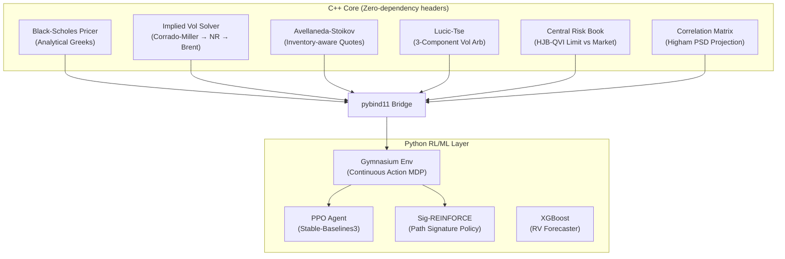

# High-Frequency Volatility Market Maker & Dispersion Arbitrage Engine


An institutional-grade, low-latency options market-making and volatility dispersion arbitrage engine. This system integrates continuous-time stochastic control models (Avellaneda-Stoikov) in C++17 with discrete-time machine learning and Reinforcement Learning (PPO, Path Signatures) in Python via `pybind11`.

Designed with a heavy emphasis on architectural purity, zero external dependencies in the hot path, and rigorous cross-verification against analytical approximations.

## 🏗️ System Architecture

The project is divided into a high-performance C++ core for pricing and risk management, and a Python layer for Reinforcement Learning, data ingestion, and simulation.



## 🧠 Core Modules (C++)

### 1. Pricing Engine (`pricing/`)
* **Black-Scholes Pricer**: Computes theoretical prices and all first/second/third-order Greeks (Δ, Γ, ν, Θ, ρ, Vanna, Volga) in a single pass using `std::erfc`.
* **Robust IV Solver**: A 3-stage guaranteed-convergence solver. Initializes with the Corrado-Miller approximation, attempts Newton-Raphson for quadratic convergence, and falls back to Brent's method for deep ITM/OTM edge cases.

### 2. Market Making (`market_making/`)
* **Avellaneda-Stoikov Model**: Calculates the inventory-adjusted reservation price and optimal bid-ask spread based on the agent's risk aversion and the probability of fill.
* **Lucic-Tse Decomposition**: Advanced quoting model that decomposes the spread into liquidity elasticity, inventory holding risk, and statistical volatility arbitrage components.

### 3. Hedging & Risk (`hedging/`)
* **Central Risk Book (CRB)**: Uses a Quasi-Variational Inequality (QVI) approach to segment delta exposure into HOLD (inner), LIMIT (middle), and MARKET (outer) zones.
* **Leland Hedging**: Adjusts implied volatility for discrete hedging transaction costs.
* **Vega Neutralizer**: Layers variance swaps and ATM straddles to isolate pure Gamma/Vega exposure.

### 4. Dispersion Trading (`dispersion/`)
* **Dirty Correlation Engine**: Calculates implied correlation between an index and its constituents weighted by variance.
* **Higham PSD Projection**: Projects noisy/empirical correlation matrices into the nearest positive semi-definite (PSD) matrix using Dykstra's alternating projection algorithm.
* **Z-Score State Machine**: Generates entry/exit signals for index vs. single-stock dispersion trades.

## 🤖 RL & ML Layer (Python)

* **Market Making Environment**: A custom Gymnasium environment that simulates a Limit Order Book. Uses a continuous action space `[bid_offset, ask_offset]`.
* **Hawkes Process Order Flow**: Replaces naive Poisson fill models with a self-exciting Hawkes process (simulated via Ogata's modified thinning algorithm) to realistically cluster order flow and simulate adverse selection.
* **Signature-REINFORCE**: A custom policy gradient agent that uses rough path signatures to capture the sequential nature of market micro-structure.

## 📊 Backtesting & Cross-Verification

The engine includes a full 252-day simulation pipeline (`sim/run_backtest.py`) that handles synthetic Geometric Brownian Motion generation or ingests real historical data via `yfinance`. 

**Mental Math Cross-Verification**: To ensure algorithmic correctness, the system outputs automated sanity checks comparing the exact C++ calculations against known trader mental-math approximations (e.g., ATM Call $\approx 0.4 \cdot S \cdot \sigma \cdot \sqrt{T}$ and ATM Vega $\approx \frac{S \sqrt{T}}{\sqrt{2\pi}}$).

## 🚀 Getting Started

### Prerequisites
* CMake 3.14+
* C++17 compliant compiler (GCC/Clang/MSVC)
* Python 3.10+

### Building the C++ Core & Tests
The C++ core is largely header-only for performance, but includes a comprehensive GoogleTest suite.

```bash
cd cpp_core
mkdir build && cd build
cmake .. -DBUILD_TESTS=ON
make -j$(nproc)
ctest --output-on-failure
```

### Compiling the Python Bindings (`pybind11`)
To use the high-performance C++ pricing engine in the Python backtest:
```bash
cd cpp_core/build
cmake .. -DBUILD_PYTHON_BINDINGS=ON
make -j$(nproc)
cp davinci_py*.so ../../
```

### Running the Backtest
```bash
# Install dependencies
pip install -r requirements.txt

# Run with synthetic data
python3 sim/run_backtest.py

# Run with real historical data (requires yfinance)
python3 sim/run_backtest.py --real-data --start-date 2023-01-01
```

### Training the RL Agents
```bash
# Train the PPO Market Maker
python3 python_rl/train.py --agent ppo --episodes 100
```
